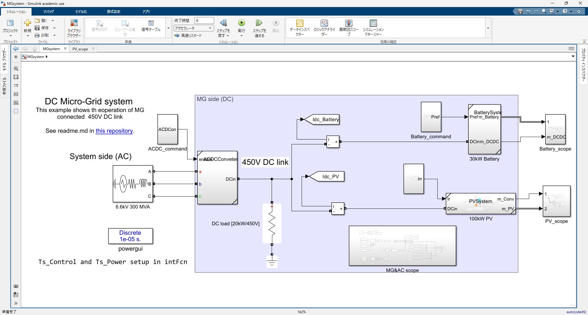
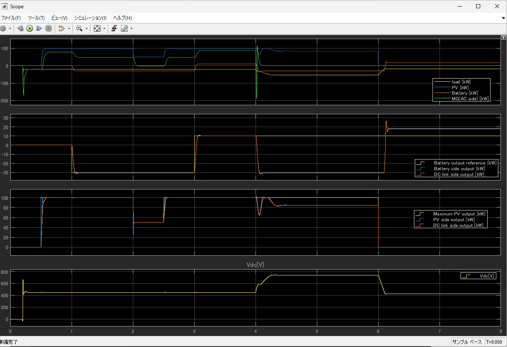
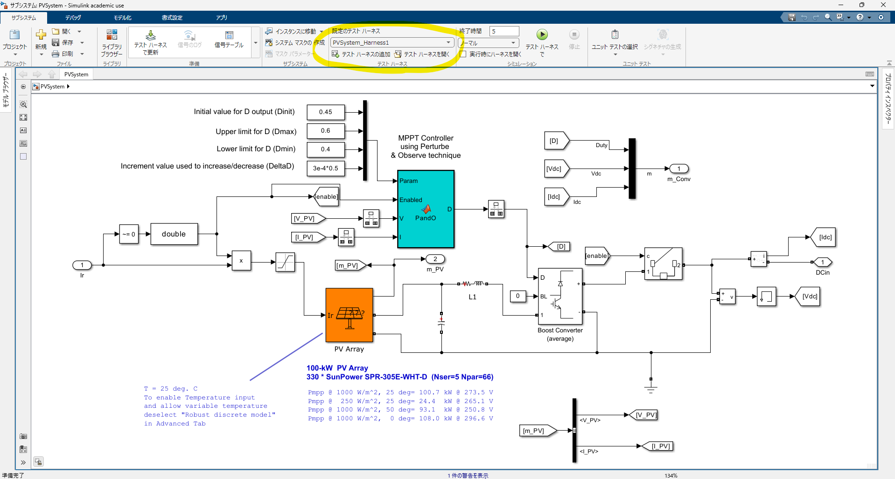
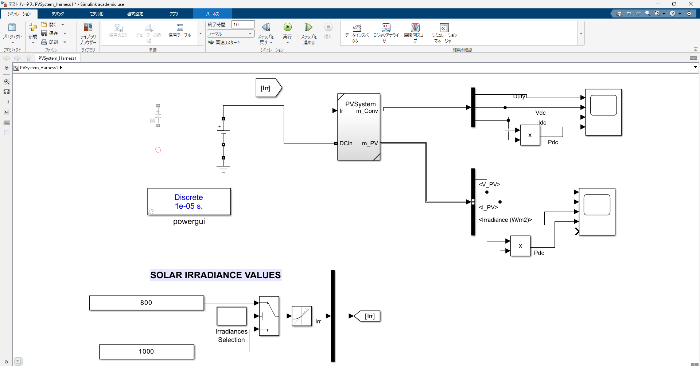

# DCMGSystem

## 概要

6.6kV系統連系のMGであり，MG側は400V系DCリンクで制御するモデルである。

このMGでは，DCリンク・蓄電池・PV・一定直流負荷があり，

- DCリンク系統におけるMG内の機器制御
  - 蓄電池の充放電制御
  - 日射量変化によるPV出力制御
- 上位系統(6.6kV)解列時のMG内の制御
  - DC電圧に応じた蓄電池の充放電制御（電圧上昇時に充電，低下時に放電）

ができるようになっている。
また，DC電圧は450Vをベースとしているが，350Vなどと電圧を下げても動作可能。

## 動作環境

- MATLAB/Simlink R2024a
  - Simscape electrical
  - Simulink Test（テストハーネスを用いる場合に必要）

## 実行方法

`MGsystem.slx`ファイルを読み込み，実行すると8秒シミュレーションが行われる。

## 参考

サブモデルとなっている

- ACDCコンバータ `ACDCConveter.slx`
- 蓄電池 `BatterySystem.slx`
- PVシステム `PVSystem.slx`

いずれもMATLAB examplesを参考している。
各サンプルは，対応するフォルダ（`ACDCConveter`,`Battery`,`PV`）の中にある，`MATLABexamples`のフォルダにあるファイルの公式サイト

- [AC/DC 3 レベル PWM コンバーター](https://jp.mathworks.com/help/sps/ug/ac-dc-three-level-pwm-converter_ja_JP.html)
- [2 象限 DC/DC コンバーター](https://jp.mathworks.com/help/sps/ug/two-quadrant-dc-dc-converter.html)
- [100 kW グリッド接続 PV アレイの平均モデル](https://jp.mathworks.com/help/sps/ug/average-model-of-a-100-kw-grid-connected-pv-array.html)

を参照されたい。
今回は，数秒～数時間の解析を目的としているため，平均モデルを用いているが，瞬時値モデルに変更して高調波解析を行うことも可能である。

### 動作確認

#### 代表的な結果の見方

`MGsystem.slx`ファイルを読み込み，8秒シミュレーションを実行すると，
`MGsystem/MG&AC scope`内の`Scope`で代表的な結果が表示される。

#### 実行時の動作

8秒間の動きは下記のとおりである。なお，カッコ内は時間制御に対応するSimulinkモデルの時間ステップ（立上り・立下り）のモデルを示す。

- 0.2秒 (`MGsystem/ACDC_command/ACDC startup`)
  - MGが系統に連系される。 ACDCはDC電圧が450Vになるように制御する。
- 0.5秒 (`MGsystem/Subsystem/PV Startup`)
  - 日射量が発生し，PVがDC系統に連系される。
- 1.0秒 (`MGsystem/Battery_command/Battery Startup`)
  - 蓄電池に指令値（30kW充電:モデル上では-30e3）が与えられ，蓄電池がDC系統に連系される。
- 2.0秒～3.0秒 (`MGsystem/Subsystem/IrradiancesSelection`)
  - 日射量が変化するため，PVは出力を変化させるが，DC系統の電圧は450Vに維持される。
- 3.0秒 (`MGsystem/Battery_command/Step`)
  - 蓄電池の指令値を10kW放電(モデル上では10e3)に変更し，放電を開始する。
- 4.0秒 (`MGsystem/ACDC_command/ACDC Stop`)
  - MGが系統から解列される。このとき，PVは出力を下げるが，DC電圧が450Vから上昇し，蓄電池の保護電圧範囲（450$\pm$ 30V）を超えるため，蓄電池は強制的に充電する。
- 6.0秒 (`MGsystem/ACDC_command/PV Stop`)
  - 日射量が0になり，PVがDC系統から解列される。このとき，DC電圧は降下し，蓄電池の保護電圧範囲(420V)以下となり，蓄電池は強制的に放電する。

#### テストハーネス

また，各サブモデルにおいて[テスト ハーネス](https://jp.mathworks.com/help/sltest/test-harnesses.html)にて，examplesと同様の単独のシミュレーションで動作確認ができるようになっている。

##### 起動方法

ここでは，PVシステム `PVSystem.slx`を例にとって説明する。

下記のようにサブシステムファイル（`PVSystem.slx`）を開き，上タブの真ん中にある「テストハーネスを開く」を押す。

テストハーネス（`PVSystem_Harness1`：ファイルは存在しない）を開くと，そのサブシステムに焦点を当てた単純なモデルでのシミュレーションが行える。

サブシステムの詳細な結果の表示（Scopeなど）は，シミュレーション増大を招くため，テストハーネス側で表示し，確認するようにしている。
そのため，個々の動作やシステムの改良はテストハーネスから始めることをお勧めする。

##### テストハーネスを開いてモデル修正する際の注意事項

テストハーネスにおけるサブシステムはメインのモデル（`MGsystem.slx`）と連動する。すなわち，テストハーネスで調整したパラメータなどは，メインのモデルでも変更されるが，同時に変更できないようにロックされることがある。ロックされている場合は，一方が修正中であるため，上書き保存するか変更を破棄して同一の状態にするとロックが解除されるはずである。

